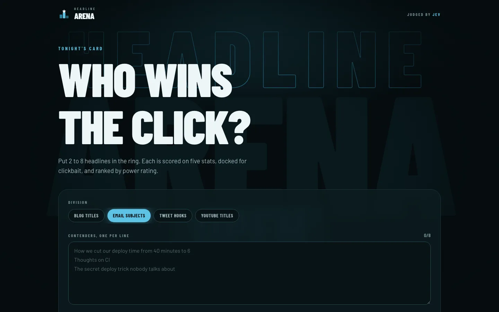
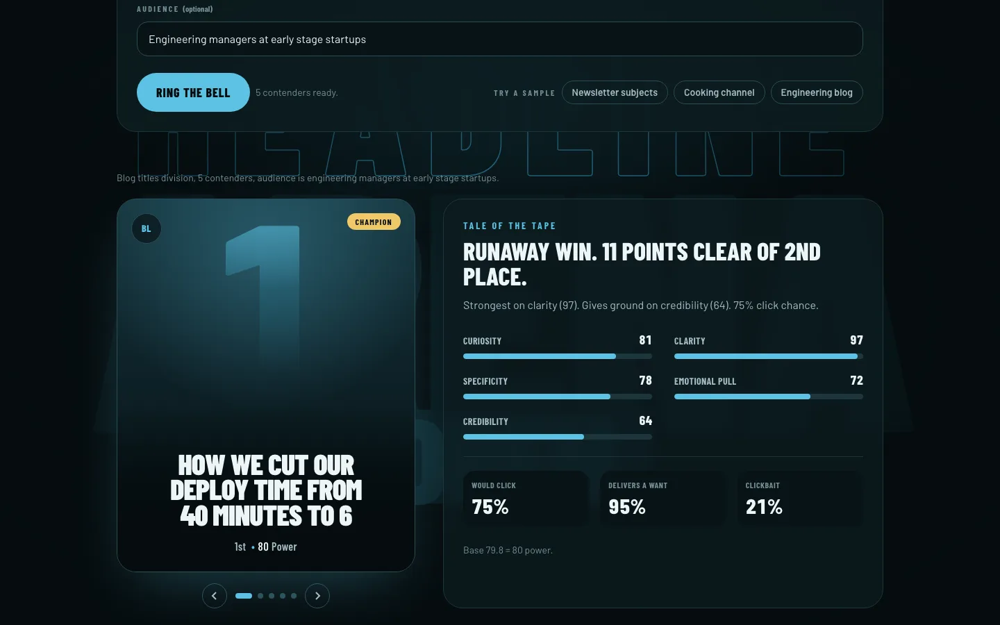

# Headline Arena

Put your headlines in the ring and see which one wins the click.

**Live demo:** https://headline-arena-gamma.vercel.app


## How it works

Paste 2 to 8 candidate headlines (blog titles, email subjects, tweet hooks or YouTube titles) plus an optional one-line audience, and they fight it out on a sports-style leaderboard. Each headline goes to TypeSafe's Jev model in its own call with the format and audience as state. Jev answers five score questions (curiosity, clarity, specificity, emotional pull, credibility) and three yes/no questions (is it clickbait, would this audience click, does it promise something they want). The app turns those numbers into a power rating out of 100: 60 points from the weighted stats, 25 from click chance, 15 from the promise, minus up to 30 once the clickbait chance passes 50%. Jev never writes any text here. Every sentence on the page is a template filled with its numbers.

Calls go through Vercel AI Gateway first and fall back to TypeSafe's own API when the Gateway is missing or fails.

## Screenshots





A longer recording is in [docs/demo.mp4](docs/demo.mp4).

## Stack

Next.js 16 (App Router), React 19, Tailwind CSS v4, TypeScript and the Vercel AI SDK, deployed on Vercel. Jev calls go through Vercel AI Gateway and fall back to the TypeSafe API. Unit tests use the Node test runner.

## Run it

```bash
npm install
cp .env.example .env.local   # add AI_GATEWAY_API_KEY and/or TYPESAFE_API_KEY
npm run dev
```

`npm test` runs the unit tests for the scoring and ranking logic. `npm run lint` and `npm run build` should both pass.

## Config

| Variable | Default | What it does |
| --- | --- | --- |
| `AI_GATEWAY_API_KEY` | one of the two | Vercel AI Gateway key, tried first |
| `TYPESAFE_API_KEY` | one of the two | TypeSafe API key, used when the Gateway is missing or fails |
| `RATE_LIMIT_ANALYZE` | `5` | bouts per IP per window |
| `RATE_LIMIT_WINDOW_MS` | `3600000` | window length, one hour |

Limits per bout: 8 headlines, 300 characters each, 200 characters of audience. The rate limiter is in-memory, so it is per serverless instance. Good enough for a demo, not for real traffic.

## Related

Built alongside [ToneRadar](https://toneradar.vercel.app), [FinePrint](https://fineprint-beta.vercel.app), [fallacy finder](https://fallacy-finder-nine.vercel.app) and [PitchPanel](https://pitchpanel.vercel.app), all on TypeSafe Jev. The first one was [JobFit](https://github.com/Sahilll15/jobfit).
